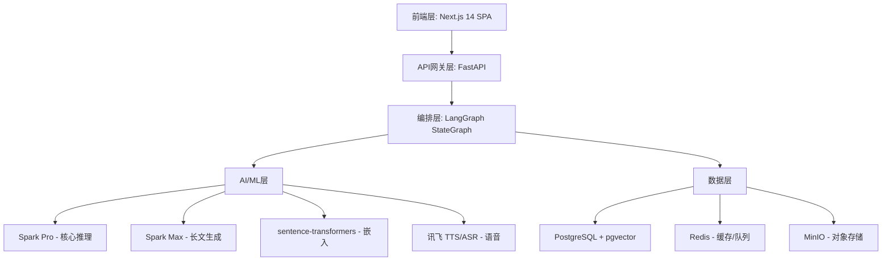
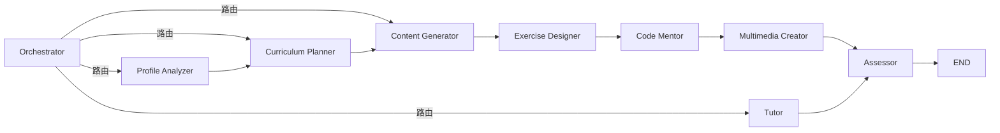

# 系统开发说明书

## 1. 项目概述

### 1.1 赛题背景

第十五届中国软件杯 A3 赛题：**基于大模型的个性化资源生成与学习多智能体系统开发**

高等教育中标准化教学难以满足学生个性化需求，学生知识吸收效率低，资源繁杂无序难以精准匹配。本项目借助科大讯飞星火大模型技术体系，构建面向**数据结构与算法**课程的个性化学习多智能体系统。

### 1.2 核心目标

- 构建包含 8 个维度的动态学生画像
- 9 个角色智能体协同生成 5 种以上个性化资源类型
- 基于 DSA 知识图谱的个性化学习路径规划
- 多模态智能辅导与学习效果评估

### 1.3 技术路线

```
用户交互 (Next.js SPA)
  → API 网关 (FastAPI)
  → 多智能体编排 (LangGraph StateGraph)
  → LLM 服务 (科大讯飞星火 Spark Pro/Max)
  → RAG 管道 (sentence-transformers + pgvector)
  → DSA 知识图谱 (30+ 知识点 + 拓扑遍历)
```

## 2. 需求分析

### 2.1 新时代大学生学习需求

1. **个性化内容**：不同学生有不同的知识基础、学习风格、目标
2. **多模态体验**：视频、图文、代码、思维导图等多种形式
3. **即时反馈**：实时答疑、练习评估、进度追踪
4. **智能推荐**：从海量资源中精准匹配适合的内容

### 2.2 技术与需求结合点

| 需求 | 技术方案 |
|------|---------|
| 个性化画像 | Spark Pro Function Calling → 8 维特征提取 |
| 多模态资源生成 | Spark Max 文本生成 + Mermaid.js 思维导图 + 代码沙箱验证 |
| 智能路径规划 | DSA 知识图谱拓扑排序 + 画像驱动权重 |
| 即时辅导 | RAG 增强 + Spark Pro 流式 SSE |
| 内容质量 | 多层防幻觉 + 内容安全过滤 + 代码执行验证 |

## 3. 系统架构

### 3.1 分层架构



### 3.2 技术栈

| 层级 | 技术选型 | 选型理由 |
|------|---------|---------|
| 前端 | Next.js 14 + React 18 + TailwindCSS | SSR, Streaming, 现代交互 |
| 状态管理 | Zustand | 轻量 TypeScript |
| 后端 | FastAPI + Uvicorn | 异步, 原生 SSE, Swagger |
| 智能体 | LangGraph + LangChain | 图编排, 检查点, 条件路由 |
| LLM | 科大讯飞星火 Spark Pro/Max | 赛题要求, 中文优化 |
| 嵌入 | sentence-transformers MiniLM | 384维, 中文支持, 轻量 |
| 数据库 | PostgreSQL 16 + pgvector | 关系+向量一体化 |
| 缓存 | Redis 7 | 会话, 队列, 限流 |
| 存储 | MinIO | S3 兼容, 自部署 |
| 部署 | Docker Compose + Nginx | 一致环境, 反代, SSL |

### 3.3 部署架构

```
┌──────────┐  ┌──────────┐  ┌──────────┐  ┌──────────┐
│ Nginx 80 │  │ Next.js  │  │ FastAPI  │  │ Celery   │
│ 反代     │  │ :3000    │  │ :8000    │  │ Worker   │
└──────────┘  └──────────┘  └──────────┘  └──────────┘
┌──────────┐  ┌──────────┐  ┌──────────┐
│ Postgres │  │ Redis 7  │  │ MinIO    │
│ +pgvector│  │ :6379    │  │ :9000    │
└──────────┘  └──────────┘  └──────────┘
```

## 4. 多智能体设计

### 4.1 智能体角色

| 智能体 | 职责 | LLM | 关键能力 |
|--------|------|-----|---------|
| **Orchestrator** | 意图路由, 状态管理 | Spark Pro | 条件路由, 工作流编排 |
| **Profile Analyzer** | 8 维画像提取 | Spark Pro | Function Calling, 置信度评分 |
| **Curriculum Planner** | 学习路径规划 | 知识图谱 | 拓扑排序, 4 种路径策略 |
| **Content Generator** | 讲义生成 | Spark Max | RAG 锚定, 风格个性化 |
| **Exercise Designer** | 练习题生成 | Spark Max | 5 题型, Bloom 分类 |
| **Multimedia Creator** | 思维导图 | Spark Max | Mermaid.js, 图谱可视化 |
| **Code Mentor** | 代码示例 | Spark Max | 沙箱验证, 失败重试 |
| **Tutor** | 多模态辅导 | Spark Pro | RAG 增强, SSE 流式 |
| **Assessor** | 质量把关 | Spark Pro | 幻觉检查, 安全过滤 |

### 4.2 LangGraph 协同流程



### 4.3 共享状态 (AgentState)

```python
class AgentState(TypedDict):
    messages: List          # 对话历史
    student_id: str         # 学生 ID
    profile: dict           # 8 维画像
    current_topic_id: str   # 当前知识点
    intent: str             # 意图路由
    learning_path: List     # 学习路径
    generated_resources: List  # 已生成资源
    quality_checks: List    # 质量检查结果
    streaming_events: List  # SSE 事件队列
    error: str              # 错误信息
```

## 5. 核心功能模块

### 5.1 对话式学习画像构建

```
学生输入 → Spark Pro 流式对话 → Function Calling 提取
  → 8 维画像: {认知风格, 知识基础, 易错点, 学习节奏,
                资源偏好, 动机水平, 注意力, 学习目标}
  → 置信度加权合并 → 版本化管理
```

### 5.2 多智能体协同资源生成

Pipeline 顺序：`Content Generator → Exercise Designer → Code Mentor → Multimedia Creator → Assessor`

生成 6 种资源类型：

| 类型 | 生成方式 | 输出格式 |
|------|---------|---------|
| 课程讲义 | RAG + Spark Max + 安全检查 | Markdown + LaTeX |
| 思维导图 | 知识图谱 → Mermaid.js | Mermaid mindmap |
| 练习题 | Spark Max 结构化 JSON | 5 种题型 |
| 拓展阅读 | Spark Max | Markdown |
| 代码案例 | Spark Max + 沙箱验证 | Python + Tests |
| 教学视频脚本 | Spark Max + TTS 旁白 | Manim 脚本 |

### 5.3 个性化学习路径规划

- 输入：DSA 知识图谱 (30+ 节点) + 学生画像
- 算法：拓扑排序 + 难度/掌握度/目标加权
- 策略：标准 / 难度递增 / 目标导向 / 深度优先
- 动态调整：评估未通过 → 补救节点；评估优异 → 加速

### 5.4 智能辅导（加分项）

- 文本：RAG 检索 → Spark Pro 流式生成
- 图解：Mermaid.js 渲染 / Spark 图片 API
- 语音：讯飞 TTS 合成
- 代码：Code Mentor 实时示例生成

### 5.5 学习效果评估（加分项）

- 多维度：知识掌握 / 技能应用 / 学习参与度 / 概念理解
- BKT 模型追踪
- 触发画像更新 → 路径重规划 → 资源策略调整

## 6. 技术实现

### 6.1 星火 API 集成

```
WebSocket 连接 (wss://spark-api.xf-yun.com)
  → HMAC-SHA256 签名认证
  → JSON 载荷 (header.parameter.payload)
  → 流式接收 choices.text.content
  → status=2 完成
```

支持 3 个模型版本：Spark Pro (generalv3.5)、Spark Max (generalv4.0)、Spark Pro 128K (pro-128k)

### 6.2 RAG 管道

```
查询 → SentenceTransformer MiniLM (384-dim)
  → pgvector <=> 余弦距离检索
  → 相似度阈值过滤 (>0.65)
  → Top-5 文档
  → 格式化注入 LLM Prompt
```

### 6.3 防幻觉策略

| 层级 | 机制 |
|------|------|
| RAG 锚定 | 所有生成基于教材语料库 |
| Prompt 工程 | 温度 0.3, 要求引用来源 |
| 代码验证 | CodeSandbox 执行验证 |
| 事实校验 | DSA 已知事实交叉比对 |
| 质量把关 | Assessor 审查 + 低分重生成 |

### 6.4 SSE 流式架构

```
FastAPI StreamingResponse
  → AsyncGenerator yield SSE events
  → text/event-stream MIME
  → 前端 EventSource / fetch ReadableStream
  → 实时渲染 (流式打字 + 进度追踪 + 资源卡片)
```

## 7. 数据库设计

### 7.1 核心表结构

| 表 | 主要字段 | 说明 |
|-----|---------|------|
| students | id, username, email, major, grade | 学生账号 |
| student_profiles | student_id, 8维画像字段, profile_version | 版本化画像 |
| dsa_topics | id, name, prerequisites, difficulty_level, category | 知识图谱节点 |
| resources | student_id, topic_id, resource_type, content, quality_score | 生成资源 |
| exercises | resource_id, question_type, difficulty, hints, bloom_level | 练习题 |
| learning_paths | student_id, topics_sequence, is_active | 学习路径 |
| knowledge_documents | topic_id, content, embedding(384), source_file | RAG 文档 |
| learning_activities | student_id, activity_type, duration, score | 学习活动日志 |
| assessment_results | student_id, topic_id, mastery_probability | 评估记录 |

### 7.2 向量索引

```sql
CREATE INDEX idx_knowledge_embedding
ON knowledge_documents
USING ivfflat (embedding vector_cosine_ops)
WITH (lists = 10);
```

## 8. 创新实践

### 8.1 图谱驱动的智能体编排

DSA 知识图谱不仅作为课程骨架，还作为智能体协作的拓扑结构。LangGraph 的路由策略直接映射知识图谱的依赖关系。

### 8.2 双用途知识图谱

同一张知识图谱同时服务两个目的：
1. **课程导航**：学生看到的是学习路径
2. **Agent 路由**：系统内部用它确定资源生成的先后顺序

### 8.3 质量把关架构

每个生成资源在交付前经过独立 Assessor Agent 审查：
- 内容安全过滤
- DSA 事实校验
- 代码执行验证（CodeSandbox）
- 低质量资源自动重生成

### 8.4 渐进式画像构建

- 开场对话（3-5 轮）→ 初始画像
- 诊断测验（5-8 题）→ 校准画像
- 学习行为追踪 → 持续更新
- 所有画像版本化管理，支持回滚

### 8.5 脚本式多模态生成

不直接生成视频/图片（昂贵且不可靠），而是生成可确定性渲染的脚本：
- Mermaid.js 代码 → 客户端渲染思维导图
- Manim Python 脚本 → 离线渲染动画
- TTS 旁白脚本 → 讯飞合成音频

## 9. UI 设计

### 9.1 页面结构

| 页面 | 功能 | 交互特性 |
|------|------|---------|
| 首页/看板 | 统计概览 + 路径预览 + 快捷操作 | 响应式网格 |
| AI 对话 | 画像构建对话 | SSE 流式输出, 演示模式降级 |
| 学习资源 | 6 类资源浏览 | 类型筛选, 卡片化展示, Markdown 渲染 |
| 学习路径 | 路径可视化 | 时间线样式, 状态标记 |
| 练习中心 | 5 题型练习 | 题型/难度筛选, 提示渐进展示, 提交评分 |
| 评估报告 | 学习评估 | 掌握度柱状图, 优劣势分析, 建议卡片 |

### 9.2 交互规范

- **流式输出**：LLM 回复实时逐字显示，避免长白屏等待
- **Markdown 渲染**：讲义支持 LaTeX 数学公式、代码高亮
- **卡片化展示**：资源/练习题/建议均以卡片呈现
- **状态反馈**：Loading Skeleton → 数据展示 → Error 重试 三种状态覆盖
- **演示模式**：无 API 环境下自动降级为预置数据，蓝色提示条标注

## 10. 接口设计

主要 API 端点：

| 方法 | 路径 | 说明 | 流式 |
|------|------|------|------|
| POST | /api/auth/register | 注册 | - |
| POST | /api/auth/login | 登录 | - |
| POST | /api/chat/profile | 对话画像 | SSE |
| GET | /api/topics | 知识点列表 | - |
| POST | /api/resources/generate | 资源生成 | SSE |
| GET | /api/resources | 资源列表 | - |
| POST | /api/exercises/submit | 提交练习 | - |
| POST | /api/tutor/ask | 智能辅导 | SSE |
| GET | /api/assessment/report | 评估报告 | - |
| POST | /api/learning-path/generate | 路径规划 | - |

## 11. 安全与合规

### 11.1 内容安全

- 敏感词过滤（中英文）
- DSA 主题相关性检查
- 内容质量启发式评估

### 11.2 防幻觉

- 温度控制（事实生成 0.3）
- RAG 锚定
- 代码沙箱验证
- DSA 事实交叉校验

### 11.3 开源合规

所有使用的外部库在 `AI_Coding工具说明.md` 中声明名称、版本和协议。
