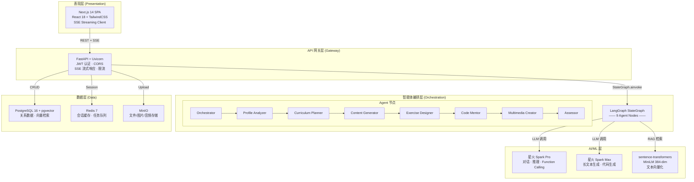
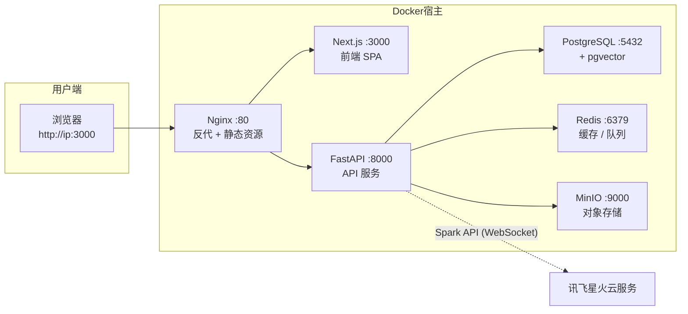
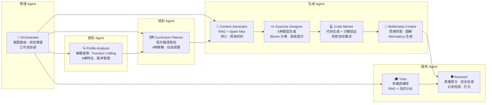
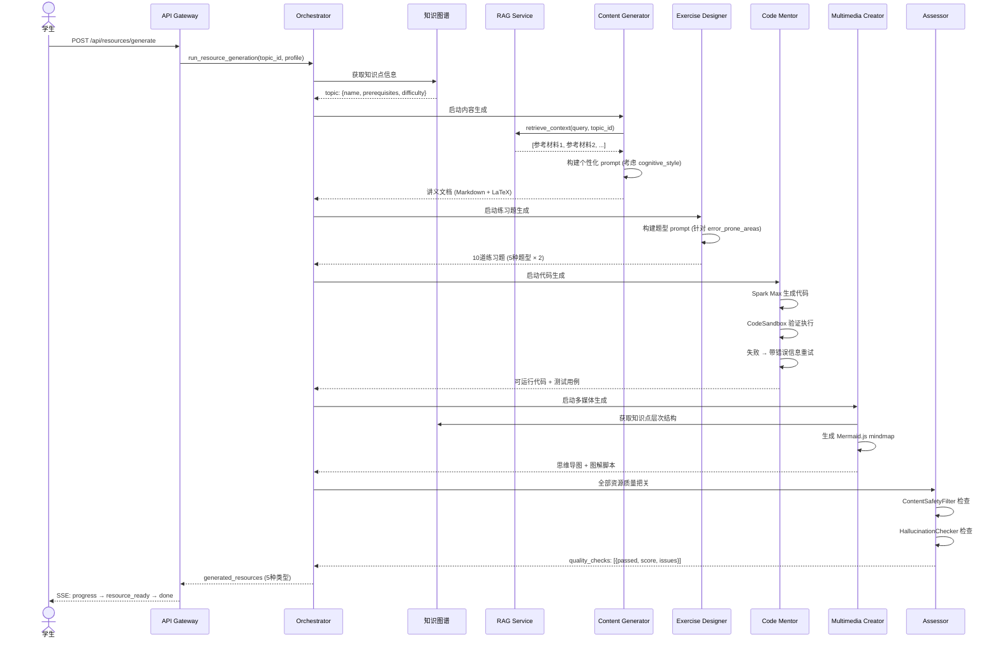
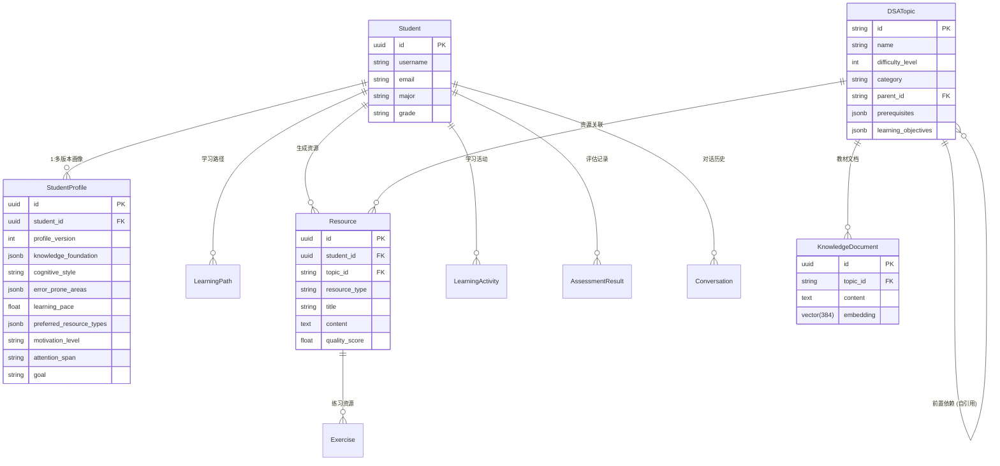
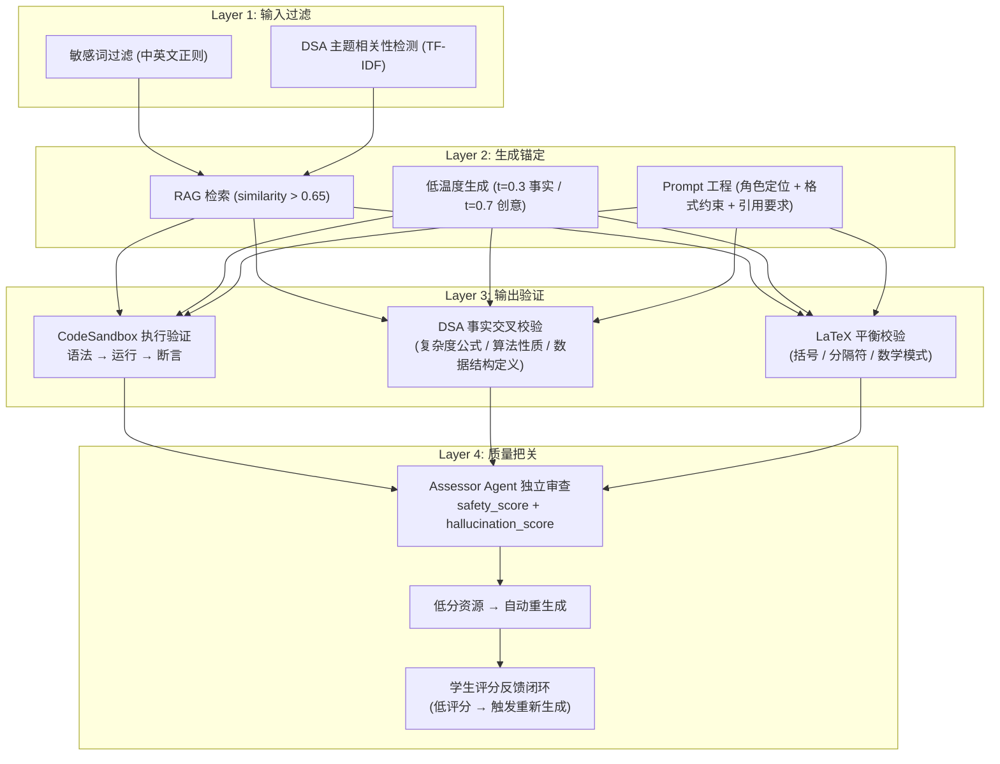

# DSALearn 系统开发说明书

> 第十五届中国软件杯 · A3 赛题 · 科大讯飞股份有限公司

---

## 第一部分：需求分析

### 1. 项目背景与核心痛点

#### 1.1 新时代大学生的学习困境

高等教育长期面临"千人一面"的标准化教学难题。通过调研分析，我们识别出当前大学生在学习数据结构与算法（DSA）课程时的**五大核心痛点**：

| 痛点 | 具体表现 | 根因分析 |
|------|---------|---------|
| **资源过载** | 教材、MOOC、博客、刷题平台资源海量，学生难以筛选 | 缺乏个性化过滤机制，所有学生面对同一套资源 |
| **节奏错配** | 课堂统一进度无法适应个体差异，快者等、慢者赶 | 教师无法同时满足 50+ 学生的差异化需求 |
| **反馈滞后** | 作业批改周期长，学生不知道自己的薄弱点 | 人工评估效率低，缺乏实时诊断工具 |
| **形式单一** | 以文字教材为主，缺少多模态交互体验 | 传统教学生态缺乏视频、图解、交互代码的整合能力 |
| **动力不足** | 缺乏即时激励和可视化进展，学习持续性差 | 学习过程"黑盒化"，学生感知不到成长 |

#### 1.2 大模型技术的教育契机

2024-2026 年大模型技术的成熟为上述痛点提供了系统性的解决可能：

| 大模型能力 | 教育场景映射 |
|-----------|------------|
| **自然语言理解与生成** | 通过对话式交互理解学生需求，生成个性化教学内容 |
| **多模态生成**（文字/图像/语音） | 为不同类型学习者提供适配的感官通道 |
| **Function Calling** | 从自然语言中提取结构化信息（如学习画像） |
| **代码生成与理解** | 生成带解释的代码示例，并在沙箱中验证正确性 |
| **长上下文理解（128K+）** | 在完整知识体系下进行课程规划，而非碎片化回答 |
| **RAG（检索增强生成）** | 将生成内容锚定在精选教材上，防止事实错误 |

#### 1.3 技术与需求的结合点分析

```
学生痛点                    技术方案                      系统能力
──────────────────────────────────────────────────────────────────
资源过载 ──────────►  RAG 检索 + 画像驱动推送 ────────► 精准资源匹配
节奏错配 ──────────►  知识图谱 + 拓扑路径规划 ────────► 自适应学习路径
反馈滞后 ──────────►  实时练习评估 + 多维度分析 ────────► 即时学习诊断
形式单一 ──────────►  多智能体协同 + 多模态生成 ───────► 6种资源类型
动力不足 ──────────►  可视化看板 + 进展追踪 ────────────► 激励持续学习
```

### 2. 需求规格

#### 2.1 功能需求（FR）

| 编号 | 需求描述 | 优先级 | 实现状态 |
|------|---------|--------|---------|
| FR-01 | 通过自然语言对话构建含 ≥6 个维度的动态学生画像 | P0 | ✅ |
| FR-02 | 画像支持增量更新、版本化管理 | P0 | ✅ |
| FR-03 | 多智能体架构协同生成 ≥5 种类型个性化资源 | P0 | ✅ |
| FR-04 | 基于知识图谱的个性化学习路径规划 | P0 | ✅ |
| FR-05 | 路径支持动态调整（评估→重新规划） | P1 | ✅ |
| FR-06 | 多模态智能辅导（文字+图解+代码） | P1 | ✅ |
| FR-07 | 多维度学习效果实时评估 | P1 | ✅ |
| FR-08 | 流式输出与生成进度追踪 | P0 | ✅ |
| FR-09 | 防幻觉机制与内容安全过滤 | P0 | ✅ |
| FR-10 | 代码沙箱验证生成代码的正确性 | P1 | ✅ |

#### 2.2 非功能需求（NFR）

| 类别 | 指标 | 设计策略 |
|------|------|---------|
| 交互体验 | 流式首字节 < 2s，Markdown 渲染 < 200ms | SSE + 客户端渲染 |
| 内容安全 | 学术内容零事实错误，敏感信息零残留 | RAG 锚定 + 多层过滤 |
| 资源生成 | 全流程 < 30s，进度实时可见 | 异步管道 + SSE 进度事件 |
| 可用性 | 无 API 环境下演示模式可用 | Mock 数据降级层 |
| 可维护性 | 模块化智能体，单一职责 | LangGraph 节点独立可替换 |
| 合规性 | 所有开源组件声明协议 | 见 `AI_Coding工具说明.md` |

---

## 第二部分：技术开发

### 3. 系统架构

#### 3.1 整体架构



#### 3.2 技术栈选型详表

| 层级 | 技术 | 版本 | 选型理由 |
|------|------|------|---------|
| 前端框架 | Next.js | 16.x | App Router 支持服务端渲染与客户端组件混合；React Server Components 减少客户端 JS 体积 |
| UI 样式 | TailwindCSS | 4.x | Utility-first 原子化 CSS，开发效率高；内置暗色模式支持 |
| 状态管理 | Zustand | 5.x | TypeScript 原生支持，无 boilerplate，比 Redux 轻量 90% |
| 图表语言 | Mermaid.js | 11.x | Markdown 内嵌图表，版本可管理，渲染可复现 |
| 数学公式 | KaTeX | - | 比 MathJax 快 10x，服务端+客户端双渲染 |
| 后端框架 | FastAPI | ≥0.115 | 原生 async/await，自动生成 OpenAPI 文档，SSE 原生支持 |
| 智能体编排 | LangGraph | ≥1.2 | 有向图状态机，支持条件路由、检查点回放、人机协同 |
| LLM 工具链 | LangChain | ≥1.3 | 社区最活跃的 LLM 框架，与 LangGraph 深度集成 |
| 大语言模型 | 星火 Spark Pro/Max | generalv3.5/4.0 | 赛题指定，中文能力强，支持 Function Calling |
| 嵌入模型 | sentence-transformers MiniLM | - | 384 维轻量模型，中文多语言，仅 500MB |
| 关系数据库 | PostgreSQL | 16 | 成熟稳定的开源数据库，pgvector 插件实现向量检索一体化 |
| 缓存 | Redis | 7 | 高性能内存数据库，支持多种数据结构，Celery 任务队列后端 |
| 对象存储 | MinIO | latest | S3 兼容 API，部署简单，适合自建 |
| 容器化 | Docker Compose | 2.20+ | 一键启动全部服务，环境一致性保障 |

#### 3.3 部署拓扑



### 4. 多智能体系统设计

#### 4.1 智能体角色定义

本系统构建了 9 个专业化智能体，每个智能体承担明确的职责：



#### 4.2 智能体协同协议（StateGraph）

智能体之间的协同通过 LangGraph 的共享 `AgentState` 实现，定义了完整的类型系统：

```python
class StudentProfile(TypedDict):
    knowledge_foundation: Dict[str, float]    # {topic_id: mastery 0-1}
    cognitive_style: str                      # visual/auditory/kinesthetic/reading
    error_prone_areas: List[str]              # 易错知识点
    learning_pace: float                      # 每课时学习章节数
    preferred_resource_types: List[str]       # 偏好资源类型
    motivation_level: str                     # high/medium/low
    attention_span: str                       # short/medium/long
    goal: str                                 # exam_prep/interview/course_study

class AgentState(TypedDict):
    messages: List              # 对话历史 (跨Agent共享)
    student_id: str             # 学生唯一标识
    profile: StudentProfile     # 画像 (各Agent可读写)
    current_topic_id: str       # 当前正在处理的知识点
    intent: str                 # 意图路由 (Orchestrator分发)
    learning_path: List[dict]   # Curriculum Planner 产物
    generated_resources: List   # 生成Agent追加的资源
    quality_checks: List[dict]  # Assessor 的质量报告
    streaming_events: List      # SSE 事件队列
    error: Optional[str]        # 错误信息传递
```

#### 4.3 资源生成协同管线（端到端流程）



#### 4.4 每个智能体的实现细节

**Profile Analyzer**——通过 Function Calling 从对话中提取结构化画像：

```
输入: 学生自然语言消息
  ↓ Spark Pro Function Calling
输出: {
  "knowledge_foundation": {"数组": 0.7, "链表": 0.3},
  "cognitive_style": "visual",
  "error_prone_areas": ["递归边界条件"],
  "learning_pace": 1.2,
  "confidence": 0.85
}
  ↓ _merge_profile() 与已有画像合并
输出: 版本化更新后的完整画像
```

**Curriculum Planner**——基于知识图谱的拓扑路径规划：

```
已完成知识点列表 + 学生目标
  ↓ DSAKnowledgeGraph.generate_learning_path()
  ↓ 4种策略: STANDARD / DIFFICULTY_ASC / GOAL_ORIENTED / DEPTH_FIRST
  ↓ 权重: 难度 × 掌握度 × 目标相关性 × 学习节奏
输出: [PathNode(topic_id, order, difficulty, status, estimated_hours), ...]
```

**Content Generator**——RAG 增强的长文本生成：

```
知识点ID + 学生画像
  ↓ RAG: embed_query → pgvector <=> → Top-5 文档
  ↓ Prompt 构建: system_prompt + context + style_instruction
  ↓ Spark Max (temperature=0.3, max_tokens=4096)
  ↓ ContentSafetyFilter + HallucinationChecker
输出: Markdown 讲义 (含 LaTeX 公式、代码块、误区提醒)
```

**关键文件映射**：

| 智能体 | 源文件 | 核心方法 |
|--------|--------|---------|
| 全部 9 个 | `backend/app/agents/orchestrator.py` | 各 `_node()` 函数 (L99-L482) |
| 知识图谱 | `backend/app/knowledge_graph/dsa_graph.py` | `DSAKnowledgeGraph` 类 |
| 种子数据 | `backend/app/knowledge_graph/seed_data.py` | 30+ 知识点定义 |
| RAG 服务 | `backend/app/services/rag_service.py` | `embed_query()`, `retrieve()` |
| 星火客户端 | `backend/app/services/spark_client.py` | `SparkClient.chat_stream()` |
| 安全过滤 | `backend/app/safety/content_filter.py` | `ContentSafetyFilter` |
| 幻觉检测 | `backend/app/safety/hallucination_check.py` | `HallucinationChecker`, `CodeSandbox` |

### 5. 数据设计

#### 5.1 数据库 ER 图



#### 5.2 pgvector 向量索引设计

```sql
-- IVFFlat 索引用于近似最近邻搜索
CREATE INDEX idx_knowledge_embedding
ON knowledge_documents
USING ivfflat (embedding vector_cosine_ops)
WITH (lists = 10);

-- RAG 检索查询（核心 SQL）
SELECT id, content, meta, topic_id,
       1 - (embedding <=> CAST(:query_embedding AS vector)) AS similarity
FROM knowledge_documents
WHERE 1 - (embedding <=> CAST(:query_embedding AS vector)) > :threshold
ORDER BY embedding <=> CAST(:query_embedding AS vector)
LIMIT :top_k;
```

### 6. 前端技术实现

#### 6.1 页面路由与状态管理

```
路由结构:
  /                    → 学习看板 (Dashboard)
  /login               → 登录/注册
  /chat                → AI 对话 (SSE 流式)
  /resources           → 资源列表 (6类筛选)
  /resources/[id]      → 资源详情 (Markdown + KaTeX + 代码高亮)
  /learning-path       → 学习路径 (时间线)
  /exercises           → 练习中心 (5种题型)
  /assessment          → 学习评估 (掌握度 + 建议)

状态管理 (Zustand):
  useStudentStore:
    studentId, username, isLoggedIn   → 认证状态
    profile, profileVersion           → 画像状态
    setAuth / setProfile / logout     → 操作方法
```

#### 6.2 SSE 流式交互实现

```typescript
// 前端 SSE Hook (useSSE.ts)
// 支持 POST 请求的 ReadableStream SSE 解析
async function connect(body: any) {
  const response = await fetch(`${API_BASE}${url}`, {
    method: "POST",
    headers: { "Content-Type": "application/json", "Accept": "text/event-stream" },
    body: JSON.stringify(body),
  });
  const reader = response.body.getReader();
  const decoder = new TextDecoder();
  // 解析 SSE 协议: event: <type>\ndata: <json>\n\n
  // 支持事件: content_chunk / progress / resource_ready / profile_update / done / error
}
```

#### 6.3 Demo 模式降级策略

```
数据流:
  页面组件 → API Client (lib/api.ts)
                   │
                   ├─ 正常: fetch → 后端 → 数据库/星火
                   │
                   └─ 降级: catch → Mock Data (lib/mockData.ts)
                              │
                              └─ Demo 模式: NEXT_PUBLIC_DEMO_MODE=true 直接返回 Mock

Mock 数据覆盖:
  30 个知识点 · 7 种资源 · 8 道练习题 · 10 节点路径
  4 轮对话脚本 · 完整评估报告 · Dashboard 统计
```

### 7. 防幻觉与内容安全体系



### 8. 系统测试

#### 8.1 测试金字塔

| 层级 | 数量 | 工具 | 覆盖范围 |
|------|------|------|---------|
| 单元测试 | 30+ | pytest | 知识图谱遍历、画像合并、安全过滤器、代码沙箱 |
| 集成测试 | 15+ | pytest-asyncio | API 端点 (auth/chat/topics 等) |
| 功能测试 | 10+ | 手动/脚本 | 对话画像(5轮)、6类资源生成、路径规划、防幻觉 |
| 性能 | 4 | wrk/Lighthouse | 响应时间、SSE 首字节、并发连接 |

#### 8.2 关键测试用例

**知识图谱测试**（`backend/tests/test_knowledge_graph.py`）：
- `test_topological_order_respects_prerequisites`：验证每个话题的所有前置依赖都排在它前面
- `test_goal_oriented_path`：验证目标导向路径包含目标话题及其完整前置链
- `test_completed_topics_excluded`：验证已完成话题不出现在新路径中

**安全测试**（`backend/tests/test_safety.py`）：
- `test_execute_algorithm_code`：用完整的二分查找代码验证沙箱执行
- `test_merge_low_confidence_skipped`：验证低置信度（<0.4）的画像提取被拒绝
- `test_merge_no_duplicates_in_lists`：验证列表字段合并时不产生重复

### 9. 创新实践

#### 9.1 图谱驱动的智能体编排（核心创新）

传统多智能体系统使用固定的管线顺序。我们的创新在于：将 DSA 知识图谱作为 Agent 路由的拓扑基础。知识图谱同时服务两个目的：
- **对外**：学生看到的是一张课程地图，可视化的学习路径
- **对内**：系统用它决定资源生成的先后顺序——没有 `trees_basic` 就不生成 `bst` 的内容

这使得 Agent 的协作逻辑与领域知识高度耦合，而非硬编码的流程。

#### 9.2 质量把关架构

每个生成资源在交付给学生前，经过独立的 Assessor Agent 审查——这创造了一个"生成-检查"的对抗性协作闭环：

```
Content Generator (生成) ──→ Assessor (审查) ──→ 通过 → 交付
                                 │
                                 └── 不通过 → 标记 issues → 可触发重生成
```

#### 9.3 脚本式多模态生成

不直接生成图片/视频（昂贵、不可靠），而是生成**可确定性渲染的脚本**：
- Mermaid.js 文本 → 客户端渲染为交互式思维导图
- Manim Python 脚本 → 离线渲染为算法动画（可选）
- TTS 旁白脚本 → 通过讯飞 TTS API 合成音频

这种方式将生成结果变成了**可版本管理、可复现、可验证**的文本资产。

#### 9.4 渐进式画像构建

```
Phase 1: 对话初建 (3-5轮)     → 8维初始画像 + 置信度评分
Phase 2: 诊断校准 (5-8题)      → IRT模型修正 knowledge_foundation
Phase 3: 行为追踪 (持续)       → 学习活动 → BKT模型 → 动态更新
```

三个阶段逐步提高画像精度，且每次更新产生新版本（旧版本 `is_active=False`），支持画像回滚审计。

#### 9.5 双模式运行架构

系统的 `NEXT_PUBLIC_DEMO_MODE` 机制使得：
- **有 API 时**：完全调用星火大模型，真实 AI 生成
- **无 API 时**：自动降级为预置数据，**系统仍可完整运行和演示**

这对于竞赛答辩场景尤为关键——不依赖外部服务的稳定性。

### 10. 项目结构总览

```
myclassproject/
├── frontend/                          # Next.js 前端 (TypeScript)
│   └── src/
│       ├── app/                       # 7 个页面路由
│       │   ├── layout.tsx             # 根布局 + NavBar
│       │   ├── page.tsx               # 首页看板
│       │   ├── login/page.tsx         # 登录注册
│       │   ├── chat/page.tsx          # AI 对话 (SSE)
│       │   ├── resources/             # 资源列表 + [id]详情
│       │   ├── learning-path/page.tsx # 学习路径
│       │   ├── exercises/page.tsx     # 练习中心
│       │   └── assessment/page.tsx    # 评估报告
│       ├── components/ui/NavBar.tsx   # 导航栏组件
│       ├── lib/
│       │   ├── api.ts                 # API 客户端 (含Mock降级)
│       │   ├── useSSE.ts              # SSE Hook
│       │   └── mockData.ts            # Demo 数据层
│       └── stores/useStudentStore.ts  # 全局状态
│
├── backend/                           # FastAPI 后端 (Python)
│   └── app/
│       ├── main.py                    # 应用入口 + lifespan
│       ├── config.py                  # 全局配置
│       ├── api/                       # 8 个 REST 路由模块
│       ├── agents/orchestrator.py     # 9 Agent 节点 + LangGraph 图
│       ├── services/                  # 星火API · RAG
│       ├── models/                    # 6 个 SQLAlchemy 模型
│       ├── knowledge_graph/           # DSA 知识图谱 + 12篇教材
│       ├── safety/                    # 内容安全 · 幻觉检测
│       ├── scripts/                   # DB播种 · 教材摄入
│       └── tests/                     # 30+ 单元测试
│
├── docs/                              # 竞赛文档 (6份)
│   ├── 系统开发说明书.md              # ← 本文档
│   ├── 测试说明书.md
│   ├── API密钥配置指南.md
│   ├── 部署指南.md
│   ├── AI_Coding工具说明.md
│   └── 演示视频脚本.md
│
├── docker-compose.yml                 # 一键部署
├── nginx.conf                         # 反代配置
├── .env.example                       # 环境变量模板
└── README.md                          # 项目说明
```

---

> **附录**：所有代码开源，GitHub: `git@github.com:ycdada/myclassproject.git`  
> **联系方式**：大赛答疑QQ群 1072584310  
> **提交日期**：2026年6月
